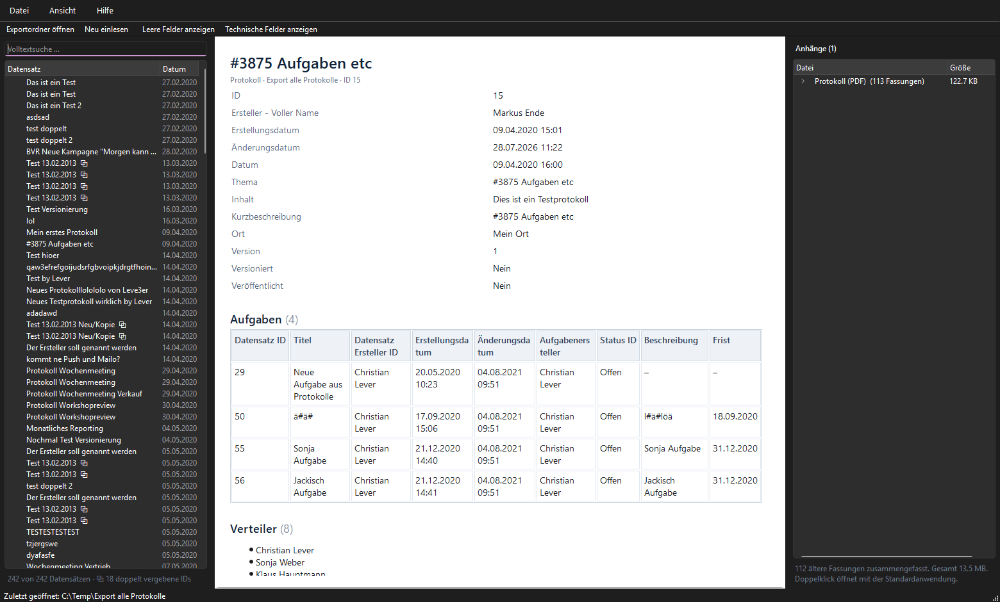

# Exit-Export Viewer

Lesende Desktop-Ansicht für JSON-Datenexporte abgekündigter Anwendungen.
Bank-Media übergibt Kunden bei Abkündigung deren Daten als Export auf
Datenträger; dieses Werkzeug macht sie für den Revisor der Bank lesbar — ohne
Browser, ohne Server, ohne Installation.



## Verwendung

```
ExitExportViewer.exe [Exportordner]
```

Ohne Argument: **Datei → Exportordner öffnen …**. Es lässt sich sowohl die
Exportwurzel als auch ein einzelner Anwendungsordner öffnen.

| Tastenkürzel | Wirkung |
|---|---|
| `Strg+O` | Exportordner öffnen |
| `F5` | Neu einlesen (Zwischenspeicher verwerfen) |
| `Strg+F` | In die Volltextsuche springen |
| `Strg+L` | Leere Felder ein-/ausblenden |
| `Strg+T` | Technische Felder (GUIDs) ein-/ausblenden |

## Für die Software-Freigabe

- **Der Export wird ausschließlich gelesen.** Es wird nie unterhalb des
  Exportordners geschrieben. Der Export darf auf einem schreibgeschützten
  Netzlaufwerk oder einem Archivdatenträger liegen. Nachgewiesen durch
  `tests/test_readonly.py`, das jeden schreibenden Dateizugriff unterhalb der
  Wurzel abfängt und zusätzlich Größen und Zeitstempel vor/nach einem
  vollständigen Durchlauf vergleicht.
- **Keine Netzwerkzugriffe.** Die Anwendung öffnet keine Sockets und lauscht auf
  keinem Port — kein localhost, kein eingebetteter Webserver. Die Akten-Ansicht
  hat einen abgeriegelten Ressourcenlader: sie liefert ausschließlich Bilder aus
  den Anhängen des gerade geöffneten Datensatzes aus, jeder andere Verweis
  (`http`, `file`, relativ) läuft ins Leere.
  *Hinweis:* `Qt6Network.dll` liegt im Bündel, weil Qt6Gui sie unter Windows als
  Abhängigkeit mitzieht. Sie wird nicht benutzt; das lässt sich mit
  `Get-NetTCPConnection -OwningProcess <PID>` gegenprüfen.
- **HTML aus den Daten wird gehärtet.** Rich-Text-Felder werden über eine
  Positivliste gefiltert: `<script>`, `<iframe>`, `<style>` und `<object>` fallen
  samt Inhalt weg, sämtliche Attribute und Adressen (`href`, `src`) werden
  entfernt.
- **Ablage außerhalb des Exports.** Der Suchindex liegt unter
  `%LOCALAPPDATA%\ExitExportViewer\`, Fenstereinstellungen in der Registry unter
  `HKCU\Software\Bank-Media\ExitExportViewer`. Der Index enthält den Textinhalt
  des Exports — bei der Freigabe mitbewerten.
- **Keine Installation, keine Laufzeitvoraussetzungen.** Eine EXE, ~46 MB.
- **Signieren vor der Verteilung.** Unsignierte EXE-Dateien werden von
  Banken-Virenschutz regelmäßig in Quarantäne genommen.

## Was die Ansicht mit den Daten macht

Der Export stammt aus einem Groovy-Skript mit `JsonBuilder`. Daraus ergeben sich
Eigenheiten, auf die die Darstellung ausgelegt ist:

- **Listen sind Maps.** `JsonBuilder` schreibt `"Verteiler": {"1": "…", "2": "…"}`
  statt eines Arrays. Zähler-Keys werden als Liste dargestellt, Text-Keys als
  Tabelle mit Bezeichnungsspalte — echte JSON-Arrays funktionieren ebenfalls.
- **Zeiten stehen in UTC.** `"Datum": "…T14:00:00+0000"` ist ein 16:00-Termin.
  Alle Zeitangaben werden nach `Europe/Berlin` umgerechnet. Fristen ohne Uhrzeit
  erscheinen als reines Datum.
- **Technische Felder werden am Wert erkannt, nicht am Namen.** Der Export
  enthält `"Datensatz Ersteller ID": "Christian Lever"` und
  `"Status ID": "Offen"` — eine Regel über den Feldnamen würde echten Inhalt
  verstecken. Ausgeblendet wird, was wie eine GUID *aussieht*.
- **Anhänge kommen von der Platte.** Das Protokoll-PDF steht in keinem Feld des
  Datensatzes, und `"Anhänge": {}` steht auch dann, wenn Dateien im Ordner
  liegen. Im Datensatz genannte Dateien werden zusätzlich hervorgehoben.
- **Versionierte Dateien werden zusammengefasst.** Dateien nach dem Muster
  `<Name>_<yyyyMMdd_HHmmss>.<ext>` erscheinen als ein Eintrag mit aufklappbarer
  Versionshistorie.
- **Bildverweise werden gegen die Anhänge aufgelöst.** Die Rich-Text-Felder
  zeigen auf Portalpfade (`userfiles/Image/…`), die es im Export nicht gibt; liegt
  die Datei als Anhang daneben, wird sie angezeigt. Sonst tritt ein benannter
  Platzhalter an ihre Stelle, damit der Fehlbestand dokumentiert ist.
- **Defekte Dateien brechen nichts ab.** Unlesbare oder ungültige JSON-Dateien
  erscheinen rot im Baum mit der Ursache. Kodierung wird erkannt (UTF-8 mit und
  ohne BOM, Rückfall auf cp1252).

## Entwicklung

```bash
python -m venv .venv
.venv\Scripts\pip install -r requirements.txt

.venv\Scripts\python -m pytest          # 168 Tests
.venv\Scripts\python run.py "C:\Temp\Export alle Protokolle"
.venv\Scripts\python build.py           # -> dist\ExitExportViewer.exe
```

### Aufbau

| Datei | Aufgabe |
|---|---|
| `exitviewer/scan.py` | Verzeichnis-Scan, Kodierungserkennung, Anhangserfassung |
| `exitviewer/fmt.py` | Wert-Kosmetik: Datum, Zahlen, Bool, GUID-Erkennung |
| `exitviewer/sanitize.py` | HTML-Positivliste für Feldwerte |
| `exitviewer/render.py` | Datensatz → Akten-HTML, Container-Erkennung |
| `exitviewer/index.py` | SQLite-FTS5-Index und Zwischenspeicher |
| `exitviewer/ui/` | Qt-Oberfläche |

### Messwerte

Gegen einen realen Export mit 242 Datensätzen, 23.003 Dateien, 2,8 GB
(davon 1,38 MB JSON — der Rest sind Anhänge):

| Vorgang | Dauer |
|---|---|
| Vollständiger Scan und Indexaufbau | ~3 s |
| Öffnen aus dem Zwischenspeicher | ~0,4 s |

## Grenzen

- Die Suche faltet Umlaute (`Prufung` findet `Prüfung`), aber **nicht** das ß —
  `Grosse` findet kein `Größe`.
- `Kategorie ID`, `Workflow ID` und `Projekt GUID` verweisen auf Daten
  **außerhalb** des Exports und sind nicht auflösbar.
- Kein Druck und kein PDF-Export.
